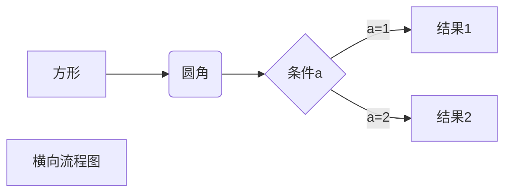
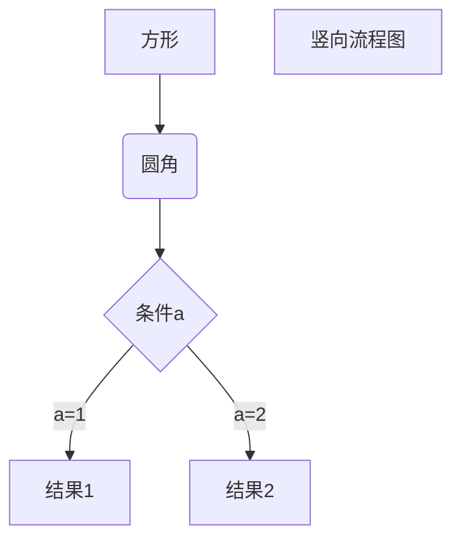
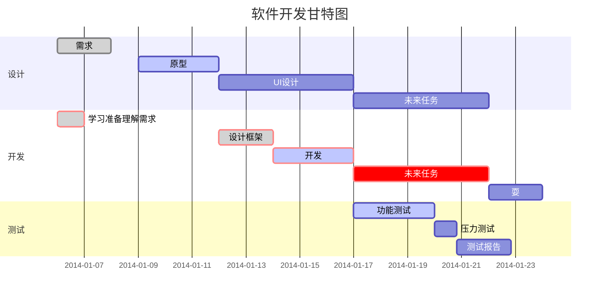

#### 1.在文字之间插入公式左右两边均使用两个美元符号，如，

```
this is an $$x+y=z$$ ，and we need to remember it.
```

this is an $$x+y=z$$ ，and we need to remember it.

左右只使用一个美元符号时，直接换行，出现公式，但本行后面无法打其它任何内容。

```
this is an $x+y=z$
```

this is an $x+y=z$


#### 2.打印行列式或矩阵

[1]

```
$$
\begin{matrix}
0 & 1 \\
1 & 0 
\end{matrix}
$$
```

$$
\begin{matrix} 0 & 1 \\
1 & 0 
\end{matrix}
$$

[2]

```
$$
\begin{pmatrix}
0 & -i \\
i & 0 
\end{pmatrix}
$$
```

$$
\begin{pmatrix} 0 & -i \\
i & 0 
\end{pmatrix}
$$

[3]

```
$$
\begin{bmatrix}
0 & -1 \\
1 & 0 
\end{bmatrix}
$$
```

$$
\begin{bmatrix} 0 & -1 \\
1 & 0 
\end{bmatrix}
$$

[4]

```
$$
\begin{Bmatrix}
1 & 0 \\
0 & -1 
\end{Bmatrix}
$$
```

$$
\begin{Bmatrix} 
1 & 0 \\
0 & -1 
\end{Bmatrix}
$$

[5]

```
$$
\begin{vmatrix}
a & b \\
c & d 
\end{vmatrix}
$$
```

$$
\begin{vmatrix}
a & b \\
c & d 
\end{vmatrix}
$$

[6]

```
$$
\begin{Vmatrix}
i & 0 \\
0 & -i 
\end{Vmatrix}
$$
```

$$
\begin{Vmatrix}
i & 0 \\
0 & -i 
\end{Vmatrix}
$$

#### 3.并列打印多个公式

```
$$
\begin{gathered}

\begin{matrix} 0 & 1 \\
1 & 0 
\end{matrix}

\quad

\begin{pmatrix} 0 & -i \\
i & 0 
\end{pmatrix}

\quad

\begin{bmatrix} 0 & -1 \\
1 & 0 
\end{bmatrix}

\end{gathered}
$$
```

效果如下：
$$
\begin{gathered}

\begin{matrix} 0 & 1 \\
1 & 0 
\end{matrix}

\quad

\begin{pmatrix} 0 & -i \\
i & 0 
\end{pmatrix}

\quad

\begin{bmatrix} 0 & -1 \\
1 & 0 
\end{bmatrix}

\end{gathered}
$$

#### 4.打印方程组

```
 \begin{equation}
 
a=\left\{   

\begin{aligned}
a+b&= 2\\   %上下的&标记的地方会对齐
a-b&=4\\
\end{aligned}

\right.         %注意末尾有个 .
\end{equation}
```

$$
\begin{equation}
a=\left\{                         
\begin{aligned}
a+b&= 2\\
a-b&=4\\
\end{aligned}
\right.
\end{equation}
$$


#### 5.各种符号的打法

|          代码          |        示例         |      |
| :--------------------: | :-----------------: | ---- |
|       \bigotimes       |   $$\bigotimes$$    |      |
|                        |                     |      |
|         \bar{}         |     $$\bar{x}$$     |      |
|         \hat{}         |     $$\hat{x}$$     |      |
|        \tilde{}        |    $$\tilde{x}$$    |      |
|         \vec{}         |     $$\vec{x}$$     |      |
|         \dot{}         |     $$\dot{x}$$     |      |
|                        |                     |      |
|          \xi           |       $$\xi$$       |      |
|        \epsilon        |    $$\epsilon$$     |      |
|      \varepsilon       |   $$\varepsilon$$   |      |
|        \upsilon        |    $$\upsilon$$     |      |
|          \phi          |      $$\phi$$       |      |
|        \varphi         |     $$\varphi$$     |      |
|          \chi          |      $$\chi$$       |      |
|          \rho          |      $$\rho$$       |      |
|          \psi          |      $$\psi$$       |      |
|          \tau          |      $$\tau$$       |      |
|                        |                     |      |
| 花写字母 I \mathscr{I} |   $$\mathscr{I}$$   |      |
|      \mathscr{L}       |   $$\mathscr{L}$$   |      |
|                        |                     |      |
|      \rightarrow       |   $$\rightarrow$$   |      |
|      \Rightarrow       |   $$\Rightarrow$$   |      |
|    \leftrightarrow     | $$\leftrightarrow$$ |      |
|    \Leftrightarrow     | $$\Leftrightarrow$$ |      |
|                        |                     |      |
|                        |                     |      |

#### 6.公式字体大小


```
$$\large \frac{1}{a+b}$$

$$\displaystyle \frac{1}{a+b}$$
```

原始大小 $$\frac{1}{a+b}$$

加\large   $$\large \frac{1}{a+b}$$

加\displaystyle  $$\displaystyle \frac{1}{a+b}$$

#### 7.图片，表格，公式的标签及引用

```

```


#### 8.多个空格

| a \qquad b | $$a \qquad b$$ |
| ---------- | -------------- |
| a \quad b  | $$a \quad b$$  |
| a\ b       | $$a\ b$$       |
| a\; b      | $$a\; b$$      |
| a\, b      | $$a\, b$$      |
| ab         | $$ab$$         |
| a \ ! b    | $$a\!b$$       |


#### 9.图片路径

typora中插入的所有图片（ 包括方便的“截图——粘贴”插入方法）在.md文件中都只保存了图片的地址，而实际的图片仍在地址处，每次打开.md文件显示图片时都需要从图片地址处读取图片然后显示。

一般插入时经常会使用图片的绝对路径，如，


当我们在另一台电脑上打开.md文件时，而这台电脑的这个绝对路径实际是没有这张图片的，因此.md文件无法显示这张图片。

办法是将.md文件和图片放在一个新建的文件夹中，且.md中使用图片的相对路径（若使用绝对路径，一旦整个文件夹移动，图片的绝对路径也会发生改变，.md文件无法读取图片），程序在读取图片时会从.md文件夹开始找，

图片在.md所在的文件夹相对路径为，


图片在.md所在的文件夹的子文件夹 'Temp' 时中相对路径为，


或，


直接使用“截图——粘贴”插入方法时，图片默认为截图时保存图片的绝对路径，此时可以将鼠标箭头放在图片上，右键——“复制图片到”，把图片复制到.md的文件夹中，再将绝对路径改为此时图片的相对路径。


注意进行网络传输（上传百度云，发给其他人）时文件夹内图片有损传输，导致传输后的图片模糊，尤其是截图的公式图片，很多上标下标会糊掉。使用.rar压缩时图片为无损压缩。


创建文件时，最好单独穿件一个文件夹用来放图片，最好用英文命名images


#### 9.图片放缩

typora不支持直接拖拉来缩放图片。但可以利用html来进行缩放。但typora支持的html语句很少。

```

```


```

```


#### 10.代码

单行代码用 重音符 括起来  

```
`this is code`
```

如： ` this is code`

多行代码，三个重音符换行即可

```
​```
mutiple code
```


#### 11.引用

加 > 即可，可以嵌套使用

> 这是引用
>
> 的内容
>
> 使得


#### 12.分割线

用3个 - 或 * 回车即可

---


#### 13.超链接

```
[知乎](http://zhihu.com)
```

如，

[知乎](http://zhihu.com)


#### 14.列表

[1]无序列表

以下3个符号加空格均可

```
- 列表内容    #注意符号和内容之间有空格
+ 列表内容
* 列表内容
```

例子，

- 列表内容例子

[2]有序列表

数字加点

```
1. 列表内容    #注意数字加点和内容之间有空格
```

1. 列表内容


[3]列表嵌套

光标在本级末尾，希望生成下一级时，回车，退格去掉自动生成的上一级，再加 - ，再打个空格

```
- 列表内容
   - 二级列表
```

- 列表

  - 二级列表
    - 三级列表


#### 15.表格

直接按快捷键"ctrl+T"也可以。但要精细操作时可以用代码。

```
姓名|技能|排行
--|:--:|--:
刘备|哭|大哥
关羽|打|二哥
张飞|骂|三弟
```

| 姓名 | 技能 | 排行 |
| ---- | :--: | ---: |
| 刘备 |  哭  | 大哥 |
| 关羽 |  打  | 二哥 |
| 张飞 |  骂  | 三弟 |

#### 16.流程图

把流程代码放进多行代码里面，把代码语言改成'mermaid'，自动生成流程图。UML时序图代码语言设为'sequence'，自动生成时序图。


---

在'mermaid'中 'graph LR'表示横向流程图，'graph TD'


`A[方形]`前面的A标识这个方框，`[]`表示画出方形，并直接将内容写作`[]`里面；

`( )`表示圆角框；

`{}`表示棱形框


`->`表示直线

`-->`表示虚线

`->>`实线箭头，`-->>`虚线箭头


`C -->|a=1| D[结果1]`其中`| |`表示在线中间加内容


[1]横向流程图

```
graph LR
A[方形] -->B(圆角)
B --> C{条件a}
C -->|a=1| D[结果1]
C -->|a=2| E[结果2]
F[横向流程图]
```

从左到右按次放

例子，



[2]竖向流程图

```
graph TD
A[方形] -->B(圆角)
B --> C{条件a}
C -->|a=1| D[结果1]
C -->|a=2| E[结果2]
F[竖向流程图]
```

从上到下按次放

例子，



[4]UML时序图

注意代码语言选择sequence

```
对象A->对象B: 对象B你好吗?（请求）
Note right of 对象B: 对象B的描述
Note left of 对象A: 对象A的描述(提示)
对象B-->对象A: 我很好(响应)
对象A->对象B: 你真的好吗？
```

例子，

```sequence
对象A->对象B: 对象B你好吗?（请求）
Note right of 对象B: 对象B的描述
Note left of 对象A: 对象A的描述(提示)
对象B-->对象A: 我很好(响应)
对象A->对象B: 你真的好吗？
```

更复杂的例子，

```
Title: 标题：复杂使用    
对象A->对象B: 对象B你好吗?（请求）
Note right of 对象B: 对象B的描述
Note left of 对象A: 对象A的描述(提示)
对象B-->对象A: 我很好(响应)
对象B->小三: 你好吗
小三-->>对象A: 对象B找我了
对象A->对象B: 你真的好吗？
Note over 小三,对象B: 我们是朋友
participant C
Note right of C: 没人陪我玩
```

从左向右看，`Note right of 对象B: 对象B描述`  把笔记放在对象B的右边

箭头，笔记从上往下放

`Note over`

`participant`

实例，

```sequence
Title: 标题：复杂使用    
对象A->对象B: 对象B你好吗?（请求）
Note right of 对象B: 对象B的描述
Note left of 对象A: 对象A的描述(提示)
对象B-->对象A: 我很好(响应)
对象B->小三: 你好吗
小三-->>对象A: 对象B找我了
对象A->对象B: 你真的好吗？
Note over 小三,对象B: 我们是朋友
participant C
Note right of C: 没人陪我玩
```


[5]甘特图

代码语言用'mermaid'

```
gantt
        dateFormat  YYYY-MM-DD
        title 软件开发甘特图
        
        section 设计
        需求                      :done,    des1, 2014-01-06,2014-01-08
        原型                      :active,  des2, 2014-01-09, 3d
        UI设计                     :         des3, after des2, 5d
   	未来任务                     :         des4, after des3, 5d
   	
        section 开发
        学习准备理解需求                      :crit, done, 2014-01-06,24h
        设计框架                             :crit, done, after des2, 2d
        开发                                 :crit, active, 3d
        未来任务                              :crit, 5d
        耍                                   :2d
    
        section 测试
        功能测试                              :active, a1, after des3, 3d
        压力测试                               :after a1  , 20h
        测试报告                               : 48h
```

`done`表示事情已完成，方框内填充灰色；`active`表示正在做，填充淡蓝色；

`crit`表示加边框；

`des1`, `des2`, `des3`, `a1` 等都用来对方框进行标记；

`after`  后面接一个方框名，表示当前方框放在这个方框后面；

`2014-01-06,2014-01-08`表示事件开始结束时间；`2014-01-09, 3d`表示开始时间，及持续时间，3天；


例子，




  

  

  


